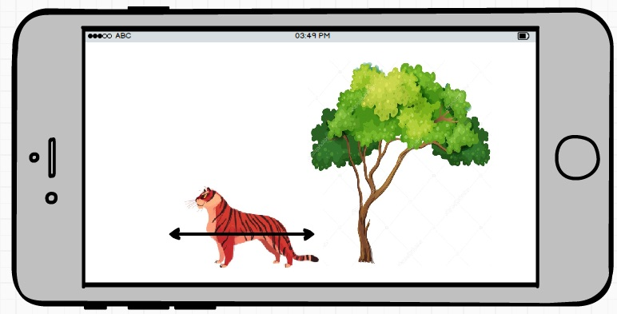

# Rain Forest - Rừng nhiệt đới

Trong ứng dụng này, chúng ta mô phỏng một khung rừng nhiệt đới.


1. Các con vật có thể di chuyển đi lại, chim có thể bay lên, hạ cánh xuống
2. Khi chạm con vật thì con vật kêu nhưng chạm vào cây thì cây không kêu.

## Hướng dẫn các bước
1. Hãy vẽ một cái cây cố định lên màn hình di động

  

2. Vẽ một hổ di chuyển từ phải qua trái. Khi ra khỏi màn hình con hổ lại quay lại từ phải qua trái.
Khi toàn bộ hình con hổ ra khỏi màn hình thì cần gán lại tọa độ của hồ về cạnh phải màn hình.

  

3. Hãy hứng sự kiện khi người dùng chạm vào con hổ, thì con hổ sẽ gầm lên.
4. Tiếp đó bổ xung hoạt hình các con vật còn lại. Chú chim cần bay chéo màn hình.

  

## Gợi ý lập trình
1. Hãy xem kỹ UIView, UIImageView. Với UIView cần tìm hiểu về 2 thuộc tính frame, bound
2. Để chế độ màn hình mặc định là landscape
3. Các dùng vòng lặp [timer](https://developer.apple.com/documentation/foundation/timer) để làm hoạt hình.
4. Bắt đầu lập trình bằng cách thủ công ít tối ưu nhưng dễ hiểu. Mỗi con vật là một biến kiểu UIImageView đặt tên là tiger, elephant, bird...

## Sử dụng kỹ thuật lập trình hướng đối tượng - OOP
Phần này dạy ở buổi sau, đừng cố nhồi nhét trong 1 buổi học khiến sinh viên khó tiếp thu.

1. Hãy tạo class Animal có thuộc tính sau
```Java
class Animal {
  UIImageView image,  //trỏ đến ảnh
  string sound,  // trỏ đến file âm thanh

  method move();
  method sound();
}
```
2. Tạo các class kế thừa từ Animal như Tiger, Elephant, Bird để viết lại phương thức move()
2. Sử dụng kỹ thuật đa hình Polymorphism: tạo mảng các đối tượng Animal, rồi gán đối tượng Tiger, Elephant, Bird vào.